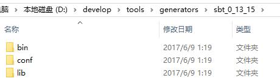
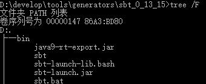

# sbt-learn
---
*通过官网文档学习*

*当然还有学习使用atom来写markdown*

### 1.安装sbt

1. windows 平台
  * win10系统
  * 通过msi文件安装 安装完成后发现path下多了一条
    * D:\develop\tools\generators\sbt\bin
    * sbt是安装在D:\develop\tools\generators\sbt
    * 看来像java一样设置一下环境变量便可以了
  * 通过zip文件安装
    * 添加一个换件变量名为SBT_HOME
    * 向path中添加%SBT_HOME%\bin
    * 下面是解压后的目录结构只包含bin、conf、lib三个目录
    * 
    * bin目录下是这样子的大概知道有那些命令可以用了
    * 

3. linux平台
  * 外传raspberry pi 3b + cent os + oracle jdk 8 安装过程
    * 下载arm版的jdk 64位和32位 如果能用64位 我就保留 64位
    * 通过flashfxp上传到root用户的家目录
    * 解压到指定目录（**根据具体下载后的文件名修改**）
      * sudo tar zxvf jdk-8-linux-arm-vfp-hflt.tar.gz -C /opt
    * 设置默认的java和javac到新安装的jdk8上
      * sudo update-alternatives --install /usr/bin/javac javac /opt/jdk1.8.0_131/bin/javac 1
      * sudo update-alternatives --install /usr/bin/java java /opt/jdk1.8.0_131/bin/java 1
      * sudo update-alternatives --config javac
      * sudo update-alternatives --config java
    * 测试一下是否安装成功
      * java -version
      * javac -version
    * 64位报错
      *  -bash: /usr/bin/javac: cannot execute binary file
